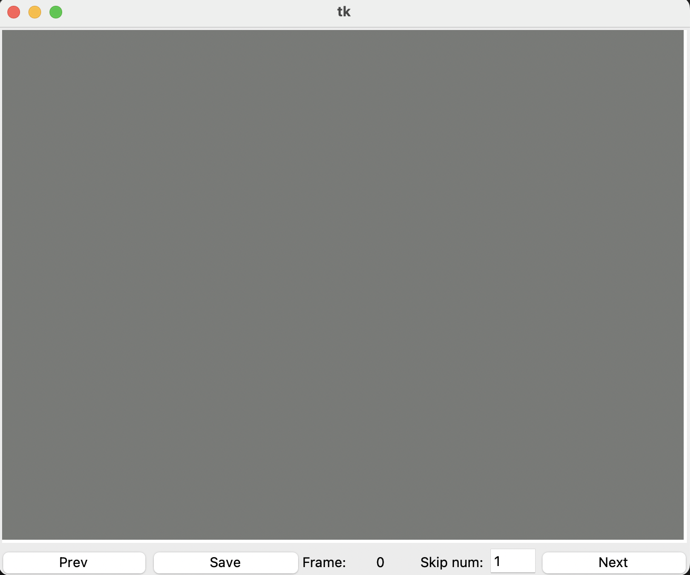

# Video Frames View and Save Tool

## Overview
This tool allows you to input video file and display single frame on window. Also you can save the frame by this tool. This tool consists of tkinter, opencv and pillow.


## Prerequisites
* Python>=3.7

## How to Install
After installing Python>=3.7, please run command below in your venv.
```bash
pip install -U pip setuptools build
python -m build
pip install dist/video_frame_viewer-1.0.0-py3-none-any.whl
```

## Usage
### App Run
[Sample code](./sample.py) is available.
```python
from frame_viewer.app import run_app

run_app(VIDEO_PATH)
```

### App Description
After starting an app, the app window will be appeared.  


App window is like this and single video frame will be displayed on the gray area in above image.

'**Frame**' label and INT number following that shows current frame index in video. '**Skip num**' means how many frames you want to skip when pusshing '**Prev**' or '**Next**' button. Also this tool accepts keyboard operations. For more detail, please refer to [next section](#operations)

### Operations
| Command | Functions |
| :- | :- |
|Press 'D' key | Move to next frame |
|Press 'Right Arrow' key | Move to next frame |
|Push 'Next' button | Move to next frame |
|Press 'A' key | Move to previous frame |
|Press 'Left Arrow' key | Move to previous frame |
|Push 'Prev' button | Move to previsou frame |
|Press 'S' key | Save current frame |
|Press 'Down Arrow' key | Save current frame |
|Push 'Save' button | Save current frame |

## Issue
* FHD Video might not be displayed correctly.